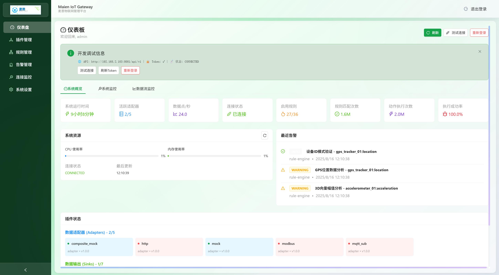
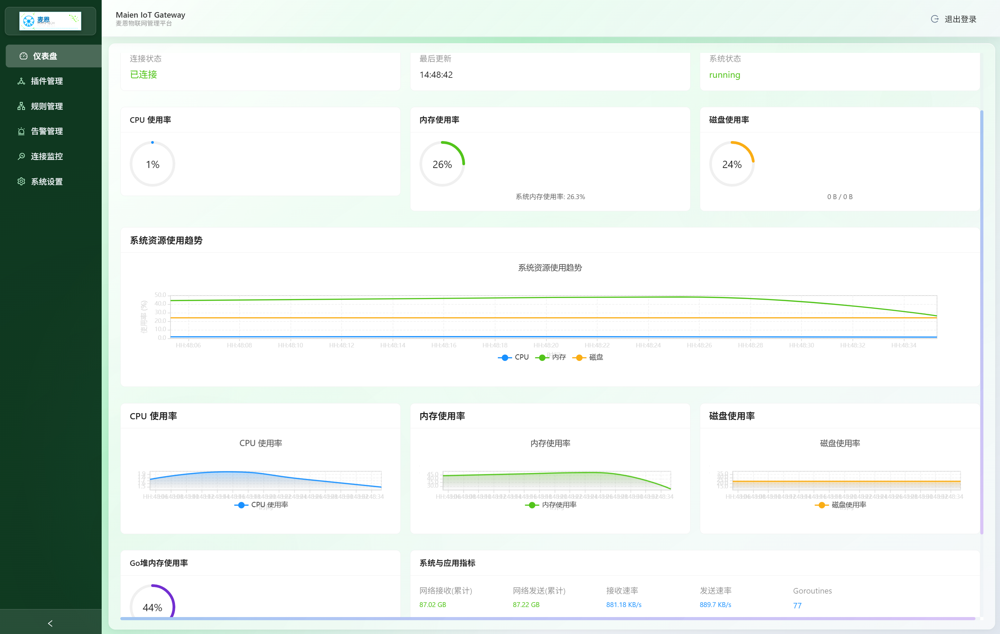
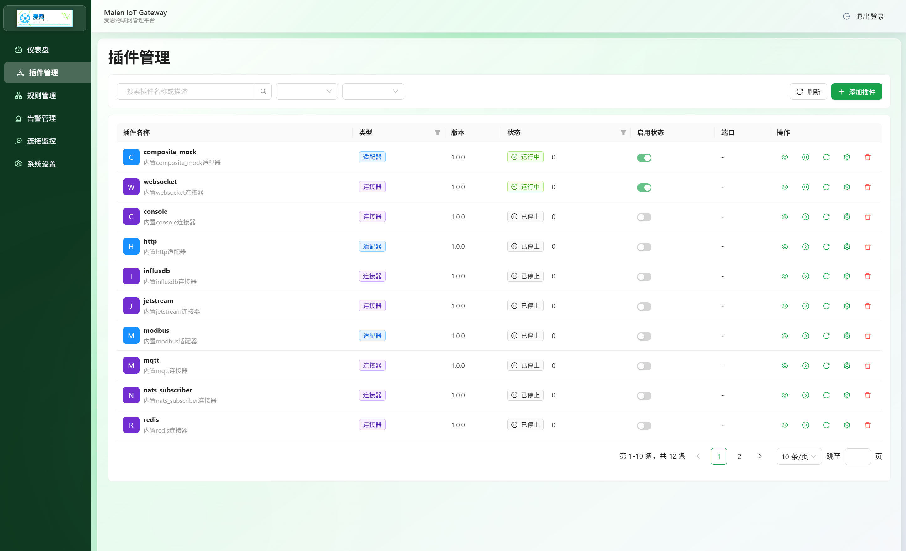
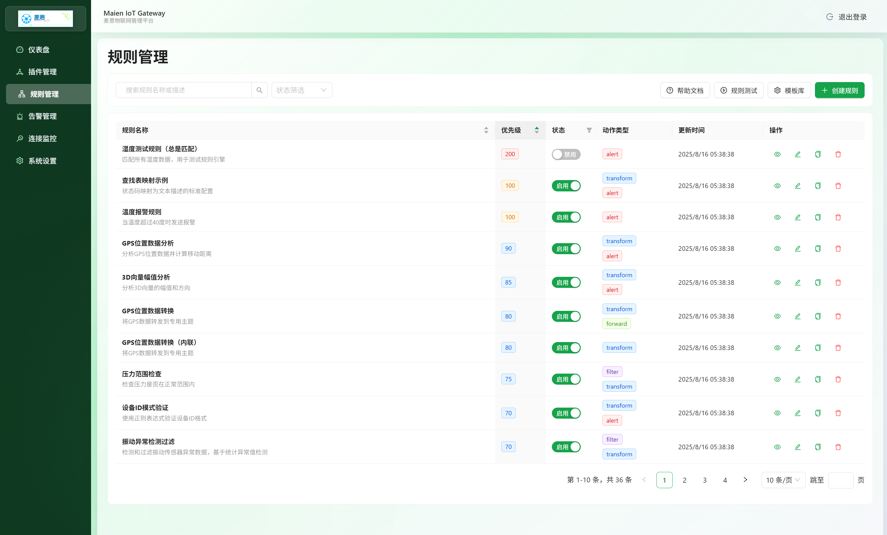
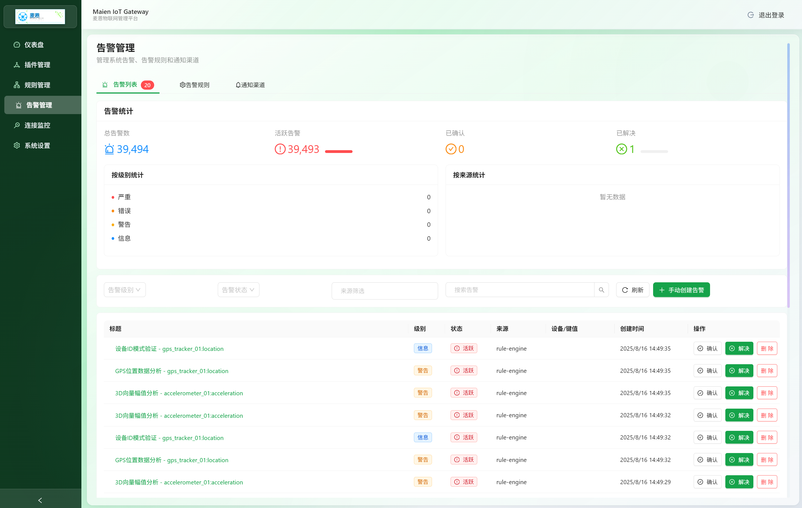
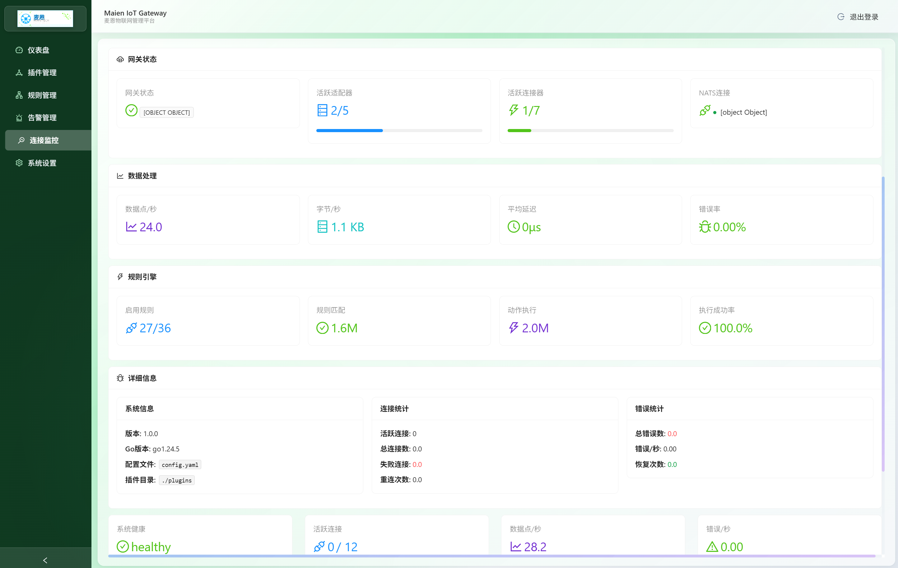
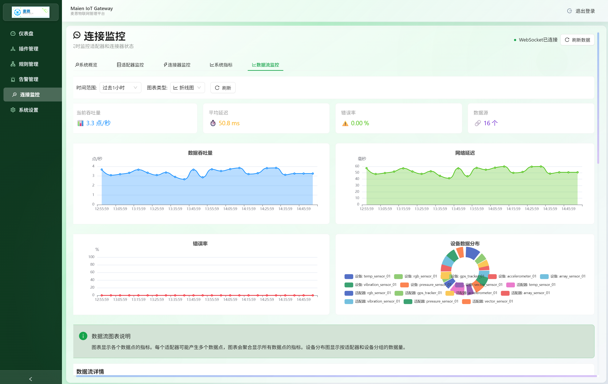
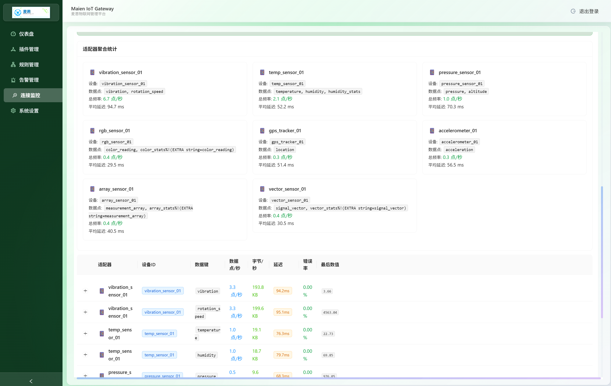

# IoT Gateway - 智能物联网数据网关平台

<div align="center">


**高性能、可扩展的物联网数据处理和管理平台**

[](https://golang.org)
[](https://reactjs.org)
[](LICENSE)
[](#)

**📖 语言版本 | Language Versions**: 
[🇨🇳 中文](README.md) | [🇺🇸 English](README_EN.md)

[功能特性](#功能特性) • [快速开始](#快速开始) • [文档](#文档) • [贡献指南](#贡献指南)

</div>

## 📋 项目简介

**麦恩IoT Gateway** 是基于高速数据总线的全新架构的高性能物联网数据网关平台，专为采集并预处理大规模设备数据而设计。它提供了完整的数据采集、处理、路由和管理解决方案，支持多种通信协议和数据格式。

### 🎯 核心优势

- **🚀 高性能**: 基于Go语言开发，支持百万级设备连接
- **🔧 插件化**: 灵活的插件架构，支持自定义适配器和数据处理器
- **⚡ 实时处理**: 基于NATS的高速消息总线，毫秒级数据处理
- **🧠 智能规则**: 强大的规则引擎，支持28种聚合函数和复杂数据类型
- **📊 可视化**: 现代化Web界面，实时监控和管理
- **🔒 企业级**: 完善的认证、权限管理和审计功能

## ✨ 功能特性

### 📡 数据采集
- **多协议支持**: Modbus、MQTT、HTTP、WebSocket等
- **设备管理**: 自动发现、状态监控、故障检测
- **数据验证**: 实时数据质量检查和异常处理
- **缓存机制**: 智能缓存策略，提高数据处理效率

### 🔄 数据处理
- **规则引擎**: 实时数据过滤、转换、聚合
- **复杂数据类型**: 支持数组、向量、GPS、颜色等复杂数据
- **28种聚合函数**: 统计分析、百分位数、异常检测等
- **流式处理**: 高吞吐量的数据流处理

### 📤 数据输出
- **多目标路由**: InfluxDB、Redis、MQTT、WebSocket等
- **格式转换**: JSON、CSV、Protocol Buffers等
- **批量处理**: 可配置的批量大小和缓冲策略
- **容错机制**: 自动重试、故障转移

### 🎛️ 管理界面
- **实时监控**: 设备状态、数据流量、系统性能
- **规则管理**: 可视化规则编辑器，支持复杂条件和动作
- **插件管理**: 动态加载、配置和监控插件
- **系统设置**: 用户管理、权限控制、审计日志

## 🚀 快速开始

### 环境要求

- **Go**: 1.24 或更高版本
- **Node.js**: 18 或更高版本
- **NATS Server**: 2.9+ (可选，支持内置模式)

### 安装部署

#### 1. 克隆项目
```bash
git clone https://github.com/y001j/IoT_Gateway.git
cd IoT_Gateway
```

#### 2. 后端构建
```bash
# 下载依赖
go mod download

# 构建网关
go build -o bin/gateway cmd/gateway/main.go

# 构建Web服务器（可选）
go build -o bin/server cmd/server/main.go
```

#### 3. 前端构建
```bash
cd web/frontend
npm install
npm run build
```

#### 4. 配置文件
```bash
# 复制示例配置
cp config.yaml config.yaml

# 编辑配置文件
nano config.yaml
```

#### 5. 启动服务
```bash
# 启动网关
./bin/gateway -config config.yaml

# 或使用开发模式
go run cmd/gateway/main.go -config config.yaml
```

访问 `http://localhost:8081` 进入管理界面。

### Docker 部署
```bash
# 构建镜像
docker build -t iot-gateway .

# 运行容器
docker run -d \
  --name iot-gateway \
  -p 8080:8080 \
  -p 8081:8081 \
  -v $(pwd)/config.yaml:/app/config.yaml \
  iot-gateway
```

## 📖 配置说明

### 基础配置
```yaml
gateway:
  name: "IoT Gateway"
  log_level: "info"
  http_port: 8080
  nats_url: "embedded"  # 或 "nats://localhost:4222"
  
# 南向适配器（数据源）
southbound:
  adapters:
    - name: "modbus_devices"
      type: "modbus"
      config:
        host: "192.168.1.100"
        port: 502
        
# 北向输出（数据目的地）
northbound:
  sinks:
    - name: "influxdb_storage"
      type: "influxdb"
      config:
        url: "http://localhost:8086"
        database: "iot_data"
        
# 规则引擎
rule_engine:
  enabled: true
  rules_dir: "./rules"
```

### 规则示例
```json
{
  "id": "temperature_alert",
  "name": "温度告警规则",
  "enabled": true,
  "conditions": {
    "type": "and",
    "and": [
      {
        "field": "key",
        "operator": "eq",
        "value": "temperature"
      },
      {
        "field": "value",
        "operator": "gt",
        "value": 40
      }
    ]
  },
  "actions": [
    {
      "type": "alert",
      "config": {
        "level": "warning",
        "message": "设备{{.DeviceID}}温度过高: {{.Value}}°C"
      }
    }
  ]
}
```

## 🏗️ 架构设计

### 系统架构
```
┌─────────────────┐    ┌─────────────────┐    ┌─────────────────┐
│   IoT 设备       │    │   数据采集层     │    │   数据处理层     │
│                 │────│                 │────│                 │
│ • Modbus       │    │ • 协议适配器     │    │ • 规则引擎       │
│ • MQTT         │    │ • 数据验证       │    │ • 数据转换       │
│ • HTTP         │    │ • 格式标准化     │    │ • 聚合计算       │
└─────────────────┘    └─────────────────┘    └─────────────────┘
                                    │
┌─────────────────┐    ┌─────────────────┐    ┌─────────────────┐
│   数据存储层     │    │   NATS 消息总线  │    │   应用服务层     │
│                 │────│                 │────│                 │
│ • InfluxDB     │    │ • 发布/订阅      │    │ • Web API       │
│ • Redis        │    │ • 流式处理       │    │ • WebSocket     │
│ • MQTT Broker  │    │ • 负载均衡       │    │ • 管理界面       │
└─────────────────┘    └─────────────────┘    └─────────────────┘

```


### 核心组件

#### 1. 运行时引擎 (`internal/core/runtime.go`)
- 服务编排和生命周期管理
- NATS消息总线集成
- 配置热重载

#### 2. 插件管理器 (`internal/plugin/`)
- 动态插件加载
- 插件生命周期管理
- ISP (IoT Service Protocol) 支持

#### 3. 规则引擎 (`internal/rules/`)
- 事件驱动数据处理
- 28种聚合函数
- 复杂数据类型支持

#### 4. 南向适配器 (`internal/southbound/`)
- Modbus TCP/RTU
- MQTT订阅
- HTTP轮询
- 模拟数据生成

#### 5. 北向输出 (`internal/northbound/`)
- InfluxDB时序数据库
- Redis缓存  
- MQTT发布
- WebSocket实时推送
- **nats_subscriber**: 关键的NATS订阅路由中心

### ⚠️ 重要架构特点：数据订阅机制

IoT Gateway采用了**分离关注点**的设计原则，对于规则引擎处理后的数据访问有重要限制：

#### Sink类型分类

**🚫 被动接收型Sink**（无法主动订阅NATS）:
- InfluxDB、Redis、Console、WebSocket、MQTT等标准Sink
- 只能通过`Publish()`方法被动接收数据
- 无法直接订阅`iot.rules.*`或`iot.alerts.*`等规则数据

**✅ 主动订阅型Sink**（能主动订阅NATS）:
- **nats_subscriber**: 唯一具备NATS订阅能力的Sink
- 实现了`NATSAwareSink`接口，能获得NATS连接
- 作为其他Sink访问规则数据的必要桥梁

#### 关键数据流路径

**❌ 错误理解**（不可行）:
```
规则引擎 → iot.rules.* → InfluxDB Sink
规则引擎 → iot.alerts.* → WebSocket Sink  
```

**✅ 正确配置**:
```
规则引擎 → iot.rules.* → nats_subscriber → 目标Sink
规则引擎 → iot.alerts.* → nats_subscriber → 多个目标Sink
```

#### 实际配置示例

```yaml
# 必须通过nats_subscriber访问规则数据
northbound:
  sinks:
    - name: "rule_data_router"
      type: "nats_subscriber"
      params:
        subscriptions:
          - subject: "iot.rules.*"
            data_type: "rule"
          - subject: "iot.alerts.*"  
            data_type: "alert"
        target_sinks:
          - name: "storage"
            type: "influxdb"
          - name: "cache"
            type: "redis"
          - name: "dashboard"
            type: "websocket"
```

**💡 设计优势**: 统一订阅管理、简化配置、清晰数据流、灵活路由转换

**📖 详细文档**: [NATS架构文档](docs/nats_architecture.md#sink架构与nats订阅机制)

## 🔧 开发指南

### 添加新的适配器
```go
// 1. 实现 Adapter 接口
type MyAdapter struct {
    name string
    config map[string]interface{}
}

func (a *MyAdapter) Start() error {
    // 启动逻辑
    return nil
}

func (a *MyAdapter) Stop() error {
    // 停止逻辑
    return nil
}

func (a *MyAdapter) GetData() <-chan model.Point {
    // 返回数据通道
    return a.dataChan
}

// 2. 注册适配器
func init() {
    southbound.RegisterAdapter("my_adapter", func() southbound.Adapter {
        return &MyAdapter{}
    })
}
```

### 添加新的规则动作
```go
// 1. 实现 ActionHandler 接口
type MyActionHandler struct{}

func (h *MyActionHandler) Name() string {
    return "my_action"
}

func (h *MyActionHandler) Execute(ctx context.Context, point model.Point, rule *rules.Rule, config map[string]interface{}) (*rules.ActionResult, error) {
    // 执行动作逻辑
    return &rules.ActionResult{
        Type:    "my_action",
        Success: true,
    }, nil
}

// 2. 注册动作处理器
func init() {
    rules.RegisterActionHandler("my_action", &MyActionHandler{})
}
```

### 聚合函数扩展
当前支持28种聚合函数：
- **基础统计**: count, sum, avg, min, max, stddev, variance, median
- **百分位数**: p25, p50, p75, p90, p95, p99
- **数据质量**: null_rate, completeness, outlier_count
- **变化检测**: change, change_rate, volatility, cv
- **阈值监控**: above_count, below_count, in_range_count

### 前端组件开发
```typescript
// 创建新的规则编辑器组件
interface MyRuleEditorProps {
  visible: boolean;
  rule: Rule;
  onSave: (ruleData: Partial<Rule>) => Promise<void>;
  onClose: () => void;
}

const MyRuleEditor: React.FC<MyRuleEditorProps> = ({
  visible,
  rule,
  onSave,
  onClose
}) => {
  // 组件实现
  return (
    <Modal
      title="自定义规则编辑器"
      open={visible}
      onCancel={onClose}
      // ... 其他属性
    >
      {/* 编辑器内容 */}
    </Modal>
  );
};
```

## 📊 性能优化

### 系统调优建议

1. **NATS 配置优化**
```yaml
gateway:
  nats_url: "nats://localhost:4222"
  nats_options:
    max_payload: 1048576
    max_pending: 65536
```

2. **规则引擎优化**
```yaml
rule_engine:
  worker_pool_size: 10
  buffer_size: 10000
  batch_size: 100
```

3. **内存管理**
```yaml
gateway:
  gc_percent: 100
  memory_limit: "2GB"
```

### 监控指标

- **系统指标**: CPU、内存、磁盘使用率
- **业务指标**: 数据处理速率、错误率、延迟
- **连接指标**: 设备连接数、消息吞吐量

## 🧪 测试

### 运行测试
```bash
# 单元测试
go test ./...

# 集成测试
go test -tags=integration ./...

# 基准测试
go test -bench=. ./internal/rules/...

# 前端测试
cd web/frontend
npm test
```

### 测试覆盖率
```bash
go test -coverprofile=coverage.out ./...
go tool cover -html=coverage.out -o coverage.html
```

## 🔌 嵌入式系统支持

IoT Gateway 专门针对嵌入式系统进行了优化，完全支持在资源受限的ARM设备上运行。

### 支持的架构

- **32位ARM系统**: ARMv5, ARMv6, ARMv7 (armhf)
- **64位ARM系统**: ARM64 (aarch64)
- **x86架构**: AMD64, 386 (兼容性支持)

### 内存对齐优化

针对32位ARM架构的特殊要求，我们已经修复了所有64位整数的内存对齐问题：
- 所有包含`int64`和`uint64`字段的结构体已重新排序
- 原子操作变量已正确对齐到8字节边界
- 确保在ARMv5/ARMv6/ARMv7平台上稳定运行

### 交叉编译脚本

#### ARM64 (64位ARM)
```bash
# 编译Gateway主程序
CGO_ENABLED=0 GOOS=linux GOARCH=arm64 go build -ldflags="-w -s" -o bin/gateway-arm64 cmd/gateway/main.go

# 编译Web服务器（可选）
CGO_ENABLED=0 GOOS=linux GOARCH=arm64 go build -ldflags="-w -s" -o bin/server-arm64 cmd/server/main.go
```

#### ARM32 (32位ARM)
```bash
# ARMv7 (推荐用于树莓派3/4等现代ARM设备)
CGO_ENABLED=0 GOOS=linux GOARCH=arm GOARM=7 go build -ldflags="-w -s" -o bin/gateway-armv7 cmd/gateway/main.go

# ARMv6 (兼容树莓派1/Zero等较老设备)
CGO_ENABLED=0 GOOS=linux GOARCH=arm GOARM=6 go build -ldflags="-w -s" -o bin/gateway-armv6 cmd/gateway/main.go

# ARMv5 (兼容更老的ARM设备)
CGO_ENABLED=0 GOOS=linux GOARCH=arm GOARM=5 go build -ldflags="-w -s" -o bin/gateway-armv5 cmd/gateway/main.go
```

#### 批量编译脚本
```bash
#!/bin/bash
# build-arm.sh - 批量编译脚本

# 创建输出目录
mkdir -p bin/

# 编译参数
LDFLAGS="-w -s"
CGO_ENABLED=0

# 编译64位ARM
echo "编译ARM64版本..."
GOOS=linux GOARCH=arm64 go build -ldflags="$LDFLAGS" -o bin/gateway-arm64 cmd/gateway/main.go

# 编译32位ARM各版本
echo "编译ARMv7版本..."
GOOS=linux GOARCH=arm GOARM=7 go build -ldflags="$LDFLAGS" -o bin/gateway-armv7 cmd/gateway/main.go

echo "编译ARMv6版本..."
GOOS=linux GOARCH=arm GOARM=6 go build -ldflags="$LDFLAGS" -o bin/gateway-armv6 cmd/gateway/main.go

echo "编译ARMv5版本..."
GOOS=linux GOARCH=arm GOARM=5 go build -ldflags="$LDFLAGS" -o bin/gateway-armv5 cmd/gateway/main.go

echo "编译完成！查看 bin/ 目录获取编译结果"
ls -la bin/gateway-arm*
```

### 嵌入式系统部署配置

针对资源受限的嵌入式设备，推荐以下配置调整：

```yaml
# config_embedded.yaml - 嵌入式系统配置示例
gateway:
  name: "IoT Gateway Embedded"
  log_level: "warn"  # 降低日志级别节省资源
  http_port: 8080
  nats_url: "embedded"  # 使用内嵌NATS减少依赖

# 热重载配置（某些嵌入式系统可能需要关闭）
hot_reload:
  enabled: true
  graceful_fallback: true  # 自动降级以兼容不支持文件监控的系统
  retry_interval: "60s"    # 增加重试间隔
  max_retries: 3

# 规则引擎资源优化
rule_engine:
  enabled: true
  worker_pool_size: 2      # 减少工作协程数
  buffer_size: 1000        # 降低缓冲区大小
  batch_size: 50           # 减少批处理大小
  rules_dir: "./rules"

# Web界面可选配置（节省资源）
web_ui:
  enabled: true
  port: 8081
  static_dir: "./web/dist"
  api_timeout: "30s"
```

### 性能调优建议

#### 内存优化
```yaml
gateway:
  gc_percent: 50        # 降低GC阈值，减少内存使用
  memory_limit: "256MB" # 根据设备内存调整
```

#### 网络优化
```yaml
gateway:
  nats_options:
    max_payload: 65536   # 减少单次传输大小
    max_pending: 1024    # 降低待处理消息数
```

### 常见嵌入式设备推荐配置

| 设备类型 | 架构 | 编译目标 | 推荐内存 | 配置调整 |
|---------|------|---------|----------|----------|
| 树莓派4 | ARM64 | `arm64` | 1GB+ | 默认配置 |
| 树莓派3 | ARMv7 | `arm GOARM=7` | 512MB+ | 减少worker数量 |
| 树莓派Zero | ARMv6 | `arm GOARM=6` | 256MB+ | 最小化配置 |
| 工业网关 | ARMv7 | `arm GOARM=7` | 256MB+ | 关闭Web界面 |

### 部署验证

编译完成后，在目标设备上验证部署：
```bash
# 检查架构兼容性
file ./gateway-armv7
ldd --version  # 检查glibc版本

# 运行测试
./gateway-armv7 -config config_embedded.yaml -version
```

## 📚 文档

- [API文档](docs/api.md)
- [配置参考](docs/configuration.md)
- [插件开发指南](docs/plugin-development.md)
- [规则引擎详解](docs/rule-engine.md)
- [部署指南](docs/deployment.md)
- [故障排除](docs/troubleshooting.md)

## 🤝 贡献指南

我们欢迎社区贡献！请遵循以下步骤：

### 贡献流程
1. Fork 项目
2. 创建特性分支 (`git checkout -b feature/AmazingFeature`)
3. 提交更改 (`git commit -m 'Add some AmazingFeature'`)
4. 推送到分支 (`git push origin feature/AmazingFeature`)
5. 创建 Pull Request

### 代码规范
- 遵循 Go 官方代码规范
- 添加必要的单元测试
- 更新相关文档
- 提交信息采用约定式提交格式

### 问题报告
如果发现bug或有功能建议，请[创建issue](https://github.com/y001j/IoT_Gateway/issues)。

## 📄 许可证

本项目采用 MIT 许可证 - 详情请查看 [LICENSE](LICENSE) 文件。

## 👥 维护团队

- **项目负责人**: [@y001j](https://github.com/y001j)
- **核心开发**: IoT Gateway Team

## 🙏 致谢

感谢以下开源项目的支持：
- [NATS](https://nats.io/) - 高性能消息系统
- [Gin](https://gin-gonic.com/) - Go Web框架
- [Ant Design](https://ant.design/) - React UI库
- [InfluxDB](https://www.influxdata.com/) - 时序数据库

## 📞 联系我们

- **项目主页**: [GitHub](https://github.com/y001j/IoT_Gateway)
- **问题反馈**: [Issues](https://github.com/y001j/IoT_Gateway/issues)

---

<div align="center">

**如果这个项目对您有帮助，请给我们一个 ⭐！**

[⬆ 回到顶部](#iot-gateway---智能物联网数据网关平台)

</div>

---

## 📸 界面截图

### 📊 主控制台 - 实时监控仪表板

*实时显示系统运行状态、设备连接数、数据处理统计和最近告警信息*

### 📈 系统监控 - 性能指标

*详细的系统资源使用情况，包括CPU、内存、磁盘使用率和Go运行时统计*

### 🔌 插件管理 - 适配器与接收器

*管理南向适配器和北向接收器，支持动态配置和状态监控*

### ⚙️ 规则引擎 - 数据处理规则

*可视化创建和管理数据处理规则，支持复杂条件和多种动作类型*

### 🚨 告警管理 - 实时告警监控

*实时监控系统告警，支持告警统计、分类管理和处理跟踪*

### 🌐 网络状态 - 连接监控

*监控网络连接状态、数据吞吐量和规则引擎性能指标*

### 📡 连接监控 - 实时数据流

*实时显示数据流量图表、错误率统计和设备数据分布*

### 📊 数据统计 - 设备数据详情

*详细的设备数据统计，包括传感器数据、处理频率和数据质量指标*

### ⚙️ 系统设置 - 配置管理

*系统配置管理，包括基本信息、资源使用情况、健康检查和规则引擎设置*