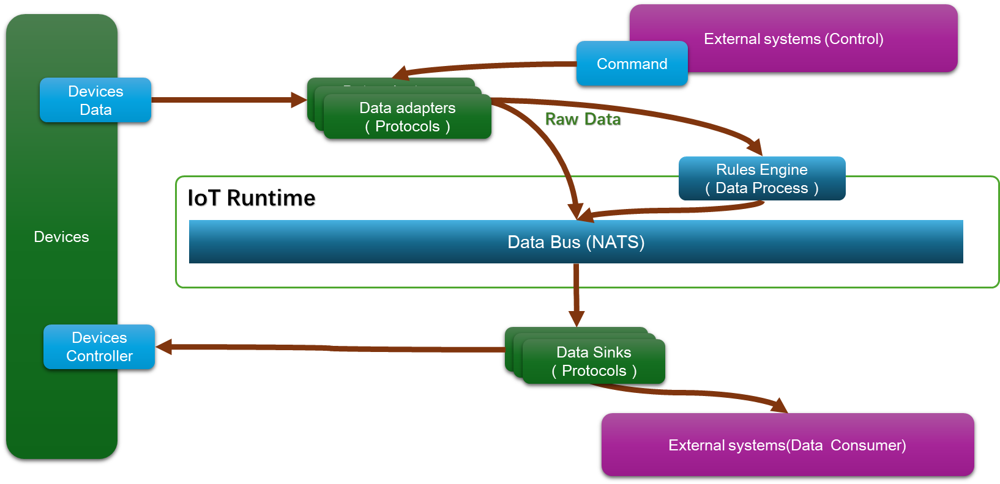

# IoT Gateway - Intelligent IoT Data Gateway Platform

<div align="center">


**High-performance, scalable IoT data processing and management platform**

[](https://golang.org)
[](https://reactjs.org)
[](LICENSE)
[](#)

[Features](#features) • [Quick Start](#quick-start) • [Documentation](#documentation) • [Contributing](#contributing)

</div>

## 📋 Overview

**Myin IoT Gateway** is a high-performance IoT data gateway platform built on a revolutionary high-speed data bus architecture, specifically designed for collecting and preprocessing large-scale device data. It provides a complete solution for data collection, processing, routing, and management, supporting multiple communication protocols and data formats.

### 🎯 Key Advantages

- **🚀 High Performance**: Built with Go, supports millions of device connections
- **🔧 Plugin Architecture**: Flexible plugin system with custom adapters and processors
- **⚡ Real-time Processing**: NATS-based high-speed message bus with millisecond processing
- **🧠 Intelligent Rules**: Powerful rule engine with 28 aggregation functions and complex data types
- **📊 Visualization**: Modern web interface with real-time monitoring and management
- **🔒 Enterprise-ready**: Complete authentication, authorization, and audit capabilities

## ✨ Features

### 📡 Data Collection
- **Multi-protocol Support**: Modbus, MQTT, HTTP, WebSocket, and more
- **Device Management**: Auto-discovery, status monitoring, fault detection
- **Data Validation**: Real-time data quality checks and anomaly handling
- **Caching Mechanism**: Smart caching strategies for improved data processing

### 🔄 Data Processing
- **Rule Engine**: Real-time data filtering, transformation, and aggregation
- **Complex Data Types**: Support for arrays, vectors, GPS, colors, and more
- **28 Aggregation Functions**: Statistical analysis, percentiles, anomaly detection
- **Stream Processing**: High-throughput data stream processing

### 📤 Data Output
- **Multi-target Routing**: InfluxDB, Redis, MQTT, WebSocket, and more
- **Format Conversion**: JSON, CSV, Protocol Buffers, etc.
- **Batch Processing**: Configurable batch sizes and buffering strategies
- **Fault Tolerance**: Automatic retry and failover mechanisms

### 🎛️ Management Interface
- **Real-time Monitoring**: Device status, data throughput, system performance
- **Rule Management**: Visual rule editor with complex conditions and actions
- **Plugin Management**: Dynamic loading, configuration, and monitoring of plugins
- **System Settings**: User management, access control, audit logs

## 🚀 Quick Start

### Prerequisites

- **Go**: 1.24 or higher
- **Node.js**: 18 or higher
- **NATS Server**: 2.9+ (optional, embedded mode supported)

### Installation

#### 1. Clone Repository
```bash
git clone https://github.com/y001j/IoT_Gateway.git
cd IoT_Gateway
```

#### 2. Build Backend
```bash
# Download dependencies
go mod download

# Build gateway
go build -o bin/gateway cmd/gateway/main.go

# Build web server (optional)
go build -o bin/server cmd/server/main.go
```

#### 3. Build Frontend
```bash
cd web/frontend
npm install
npm run build
```

#### 4. Configuration
```bash
# Copy example configuration
cp config_rule_engine_test.yaml config.yaml

# Edit configuration
nano config.yaml
```

#### 5. Start Services
```bash
# Start gateway
./bin/gateway -config config.yaml

# Or run in development mode
go run cmd/gateway/main.go -config config.yaml
```

Access the management interface at `http://localhost:8081`.

### Docker Deployment
```bash
# Build image
docker build -t iot-gateway .

# Run container
docker run -d \
  --name iot-gateway \
  -p 8080:8080 \
  -p 8081:8081 \
  -v $(pwd)/config.yaml:/app/config.yaml \
  iot-gateway
```

## 📖 Configuration

### Basic Configuration
```yaml
gateway:
  name: "IoT Gateway"
  log_level: "info"
  http_port: 8080
  nats_url: "embedded"  # or "nats://localhost:4222"
  
# Southbound adapters (data sources)
southbound:
  adapters:
    - name: "modbus_devices"
      type: "modbus"
      config:
        host: "192.168.1.100"
        port: 502
        
# Northbound sinks (data destinations)
northbound:
  sinks:
    - name: "influxdb_storage"
      type: "influxdb"
      config:
        url: "http://localhost:8086"
        database: "iot_data"
        
# Rule engine
rule_engine:
  enabled: true
  rules_dir: "./rules"
```

### Rule Example
```json
{
  "id": "temperature_alert",
  "name": "Temperature Alert Rule",
  "enabled": true,
  "conditions": {
    "type": "and",
    "and": [
      {
        "field": "key",
        "operator": "eq",
        "value": "temperature"
      },
      {
        "field": "value",
        "operator": "gt",
        "value": 40
      }
    ]
  },
  "actions": [
    {
      "type": "alert",
      "config": {
        "level": "warning",
        "message": "Device {{.DeviceID}} temperature too high: {{.Value}}°C"
      }
    }
  ]
}
```

## 🏗️ Architecture

### System Architecture
```
┌─────────────────┐    ┌─────────────────┐    ┌─────────────────┐
│   IoT Devices   │    │ Data Collection │    │ Data Processing │
│                 │────│                 │────│                 │
│ • Modbus       │    │ • Protocol      │    │ • Rule Engine   │
│ • MQTT         │    │   Adapters      │    │ • Data          │
│ • HTTP         │    │ • Data          │    │   Transformation│
│                 │    │   Validation    │    │ • Aggregation   │
└─────────────────┘    └─────────────────┘    └─────────────────┘
                                    │
┌─────────────────┐    ┌─────────────────┐    ┌─────────────────┐
│   Data Storage  │    │   NATS Message  │    │ Application     │
│                 │────│      Bus        │────│   Services      │
│ • InfluxDB     │    │ • Pub/Sub       │    │ • Web API       │
│ • Redis        │    │ • Stream        │    │ • WebSocket     │
│ • MQTT Broker  │    │   Processing    │    │ • Management UI │
└─────────────────┘    └─────────────────┘    └─────────────────┘

```


### Core Components

#### 1. Runtime Engine (`internal/core/runtime.go`)
- Service orchestration and lifecycle management
- NATS message bus integration
- Configuration hot-reload

#### 2. Plugin Manager (`internal/plugin/`)
- Dynamic plugin loading
- Plugin lifecycle management
- ISP (IoT Service Protocol) support

#### 3. Rule Engine (`internal/rules/`)
- Event-driven data processing
- 28 aggregation functions
- Complex data type support

#### 4. Southbound Adapters (`internal/southbound/`)
- Modbus TCP/RTU
- MQTT subscription
- HTTP polling
- Mock data generation

#### 5. Northbound Sinks (`internal/northbound/`)
- InfluxDB time-series database
- Redis caching
- MQTT publishing
- WebSocket real-time streaming

## 🔧 Development Guide

### Adding New Adapters
```go
// 1. Implement Adapter interface
type MyAdapter struct {
    name string
    config map[string]interface{}
}

func (a *MyAdapter) Start() error {
    // Start logic
    return nil
}

func (a *MyAdapter) Stop() error {
    // Stop logic
    return nil
}

func (a *MyAdapter) GetData() <-chan model.Point {
    // Return data channel
    return a.dataChan
}

// 2. Register adapter
func init() {
    southbound.RegisterAdapter("my_adapter", func() southbound.Adapter {
        return &MyAdapter{}
    })
}
```

### Adding New Rule Actions
```go
// 1. Implement ActionHandler interface
type MyActionHandler struct{}

func (h *MyActionHandler) Name() string {
    return "my_action"
}

func (h *MyActionHandler) Execute(ctx context.Context, point model.Point, rule *rules.Rule, config map[string]interface{}) (*rules.ActionResult, error) {
    // Action execution logic
    return &rules.ActionResult{
        Type:    "my_action",
        Success: true,
    }, nil
}

// 2. Register action handler
func init() {
    rules.RegisterActionHandler("my_action", &MyActionHandler{})
}
```

### Aggregation Functions
Currently supports 28 aggregation functions:
- **Basic Statistics**: count, sum, avg, min, max, stddev, variance, median
- **Percentiles**: p25, p50, p75, p90, p95, p99
- **Data Quality**: null_rate, completeness, outlier_count
- **Change Detection**: change, change_rate, volatility, cv
- **Threshold Monitoring**: above_count, below_count, in_range_count

### Frontend Development
```typescript
// Create new rule editor component
interface MyRuleEditorProps {
  visible: boolean;
  rule: Rule;
  onSave: (ruleData: Partial<Rule>) => Promise<void>;
  onClose: () => void;
}

const MyRuleEditor: React.FC<MyRuleEditorProps> = ({
  visible,
  rule,
  onSave,
  onClose
}) => {
  // Component implementation
  return (
    <Modal
      title="Custom Rule Editor"
      open={visible}
      onCancel={onClose}
      // ... other props
    >
      {/* Editor content */}
    </Modal>
  );
};
```

## 📊 Performance Tuning

### System Optimization

1. **NATS Configuration**
```yaml
gateway:
  nats_url: "nats://localhost:4222"
  nats_options:
    max_payload: 1048576
    max_pending: 65536
```

2. **Rule Engine Optimization**
```yaml
rule_engine:
  worker_pool_size: 10
  buffer_size: 10000
  batch_size: 100
```

3. **Memory Management**
```yaml
gateway:
  gc_percent: 100
  memory_limit: "2GB"
```

### Monitoring Metrics

- **System Metrics**: CPU, memory, disk usage
- **Business Metrics**: Data processing rate, error rate, latency
- **Connection Metrics**: Device connections, message throughput

## 🧪 Testing

### Running Tests
```bash
# Unit tests
go test ./...

# Integration tests
go test -tags=integration ./...

# Benchmarks
go test -bench=. ./internal/rules/...

# Frontend tests
cd web/frontend
npm test
```

### Test Coverage
```bash
go test -coverprofile=coverage.out ./...
go tool cover -html=coverage.out -o coverage.html
```

## 📚 Documentation

- [API Documentation](docs/api.md)
- [Configuration Reference](docs/configuration.md)
- [Plugin Development Guide](docs/plugin-development.md)
- [Rule Engine Details](docs/rule-engine.md)
- [Deployment Guide](docs/deployment.md)
- [Troubleshooting](docs/troubleshooting.md)

## 🤝 Contributing

We welcome community contributions! Please follow these steps:

### Contribution Process
1. Fork the repository
2. Create a feature branch (`git checkout -b feature/AmazingFeature`)
3. Commit your changes (`git commit -m 'Add some AmazingFeature'`)
4. Push to the branch (`git push origin feature/AmazingFeature`)
5. Create a Pull Request

### Code Standards
- Follow Go official coding standards
- Add necessary unit tests
- Update relevant documentation
- Use conventional commit format

### Issue Reporting
If you find bugs or have feature suggestions, please [create an issue](https://github.com/y001j/IoT_Gateway/issues).

## 📄 License

This project is licensed under the MIT License - see the [LICENSE](LICENSE) file for details.

## 👥 Maintainers

- **Project Lead**: [@y001j](https://github.com/y001j)
- **Core Team**: IoT Gateway Team

## 🙏 Acknowledgments

Thanks to the following open source projects:
- [NATS](https://nats.io/) - High-performance messaging system
- [Gin](https://gin-gonic.com/) - Go web framework
- [Ant Design](https://ant.design/) - React UI library
- [InfluxDB](https://www.influxdata.com/) - Time series database

## 📞 Contact

- **Project Home**: [GitHub](https://github.com/y001j/IoT_Gateway)
- **Issue Reports**: [Issues](https://github.com/y001j/IoT_Gateway/issues)
- **Discussions**: [Discussions](https://github.com/y001j/IoT_Gateway/discussions)

---

<div align="center">

**If this project helps you, please give us a ⭐!**

[⬆ Back to Top](#iot-gateway---intelligent-iot-data-gateway-platform)

</div>