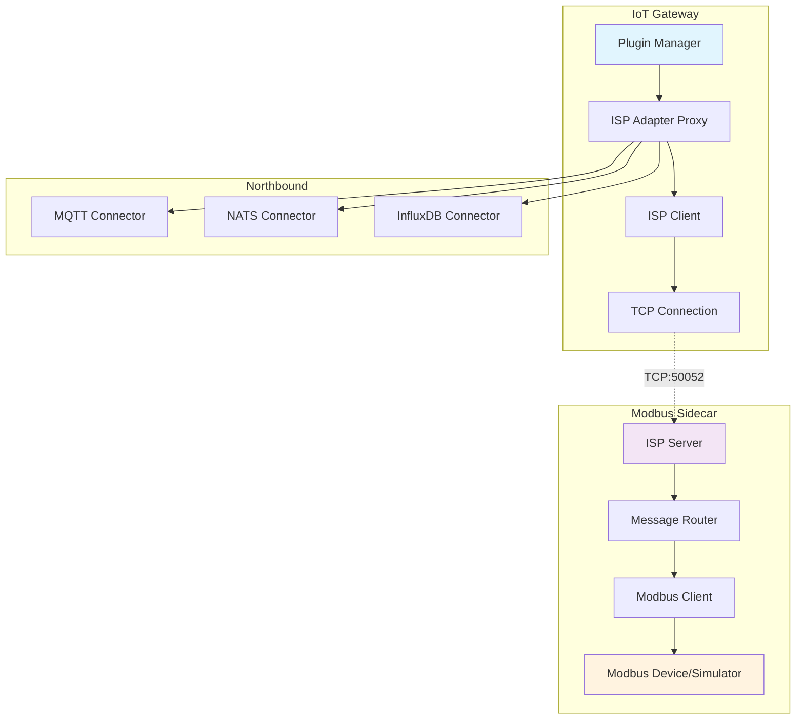
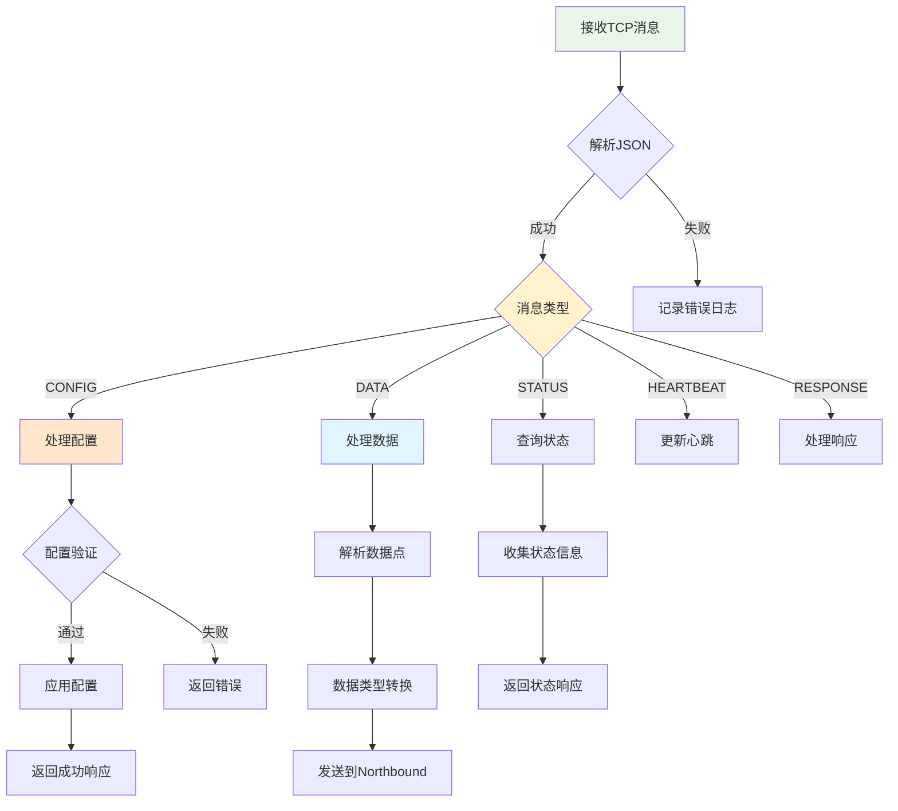
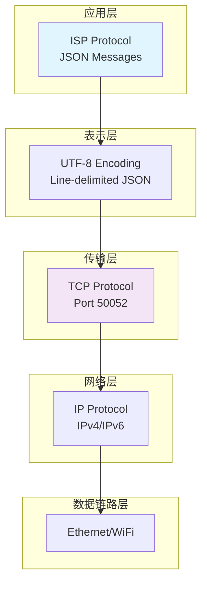
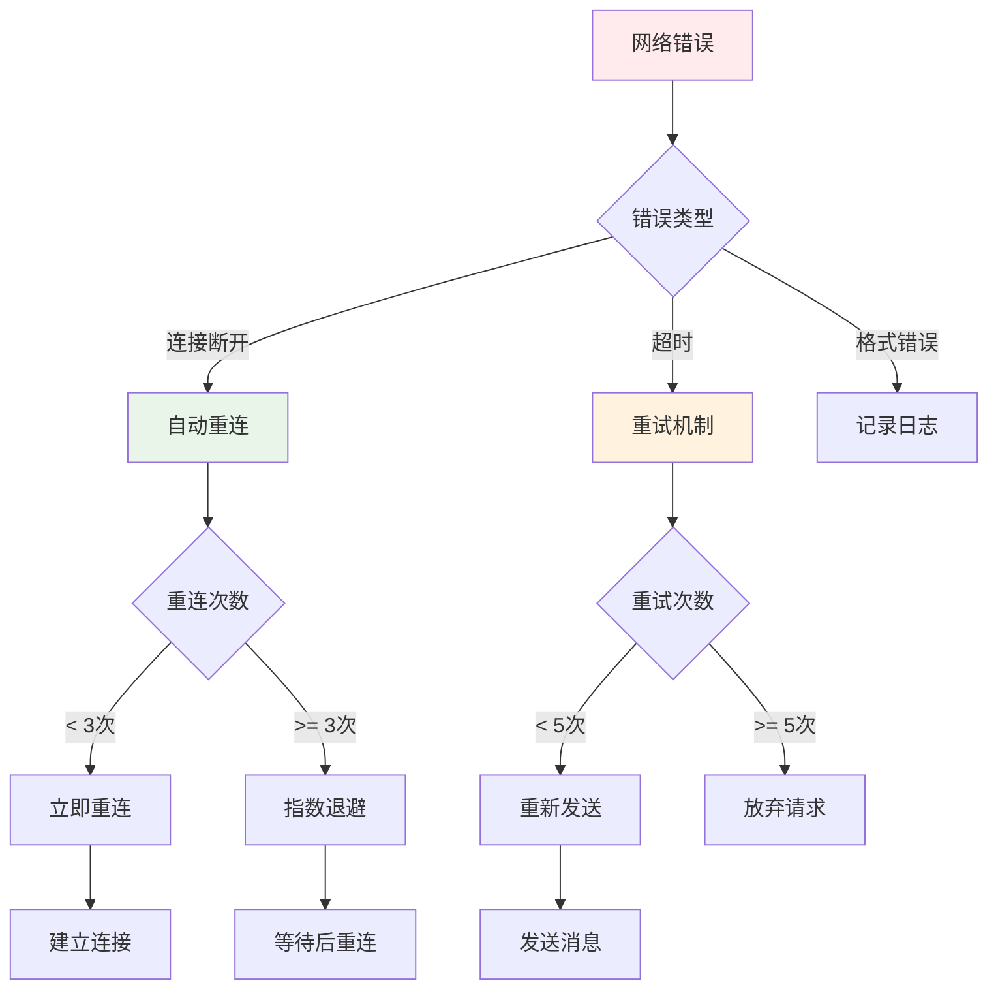
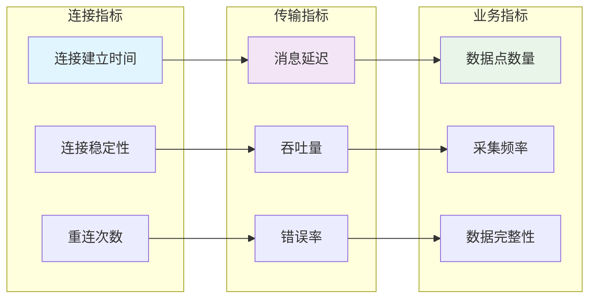
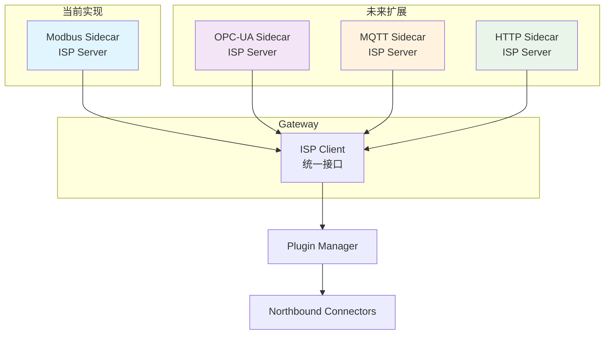
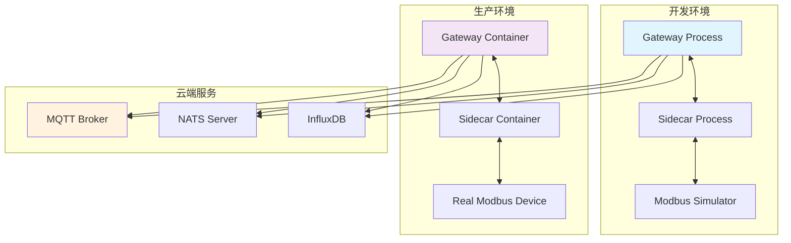
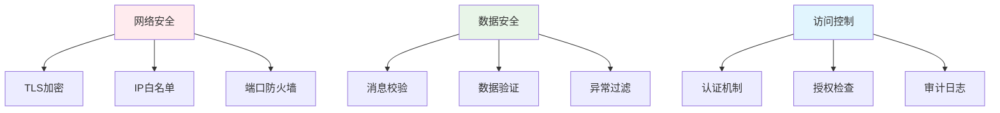

# ISP协议架构设计

## 系统架构概览

ISP (IoT Sidecar Protocol) 协议采用客户端-服务器架构，Gateway作为客户端，Sidecar作为服务器。

## 组件架构图



## 数据流程图

```mermaid
sequenceDiagram
    participant G as Gateway
    participant S as Sidecar
    participant M as Modbus Device
    participant C as Cloud (MQTT/NATS)
    
    Note over G,S: 1. 连接建立阶段
    G->>S: TCP连接 (端口50052)
    S-->>G: 连接确认
    
    Note over G,S: 2. 配置阶段
    G->>S: CONFIG消息
    Note over S: 解析配置<br/>初始化Modbus客户端
    S-->>G: RESPONSE (success)
    
    Note over G,S: 3. 数据采集阶段
    loop 每2秒
        S->>M: 读取Modbus寄存器
        M-->>S: 寄存器数据
        Note over S: 解析数据<br/>转换为数据点
        S->>G: DATA消息 (批量数据点)
        Note over G: 转换为内部格式
        G->>C: 发布到云端
    end
    
    Note over G,S: 4. 状态监控 (可选)
    G->>S: STATUS查询
    S-->>G: RESPONSE (状态信息)
    
    Note over G,S: 5. 心跳保活
    G<-->S: HEARTBEAT消息
```

## 消息处理流程



## 网络协议栈



## 错误处理机制



## 性能监控指标



## 扩展架构



## 部署架构



## 关键设计决策

### 1. 为什么选择TCP而不是UDP？
- **可靠性**: IoT数据传输需要保证可靠性
- **顺序**: 数据点需要按时间顺序处理
- **连接状态**: 需要知道连接是否正常

### 2. 为什么选择JSON而不是二进制协议？
- **可读性**: 便于调试和问题排查
- **扩展性**: 易于添加新字段
- **兼容性**: 跨语言支持良好

### 3. 为什么使用Line-delimited JSON？
- **流式处理**: 支持连续的消息流
- **边界清晰**: 每行一个完整消息
- **解析简单**: 标准的换行符分隔

### 4. 批量传输的优势
- **效率**: 减少网络往返次数
- **吞吐量**: 提高数据传输速度
- **资源利用**: 降低CPU和网络开销

## 安全考虑



## 总结

ISP协议通过简洁的设计和清晰的架构，成功替换了复杂的gRPC协议，为IoT Gateway提供了高效、可靠、易维护的Sidecar通信解决方案。其模块化的设计使得系统具有良好的扩展性，能够支持未来更多类型的IoT设备接入。 