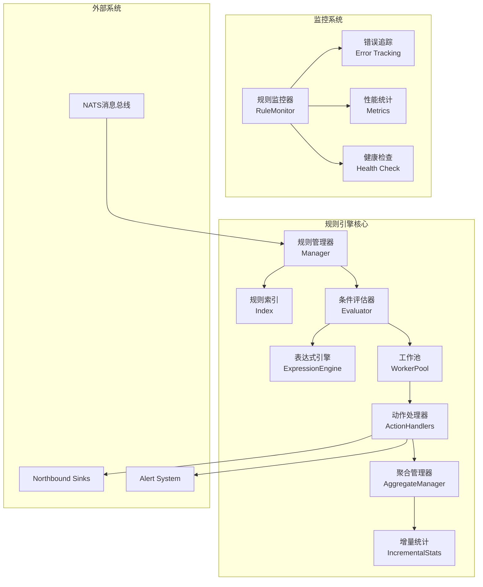
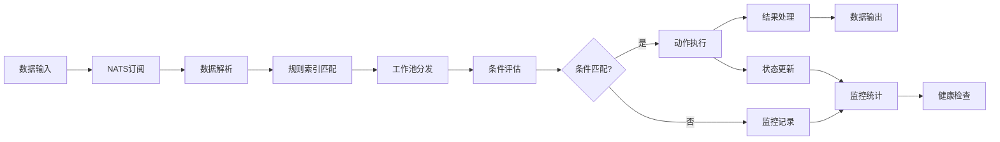

# 规则引擎概述

## 简介

规则引擎是IoT网关的核心组件之一，提供了强大的数据处理和业务逻辑执行能力。它采用事件驱动架构，基于NATS消息总线实现实时数据处理，支持灵活的规则配置和丰富的动作类型。经过最新优化，规则引擎在性能、可观测性和可靠性方面都有了显著提升。

## 核心特性

### 🚀 高性能特性
- **并行处理**: 工作池模式，支持规则级并行评估和动作执行
- **增量统计**: O(1)复杂度的聚合计算，大幅提升聚合性能
- **内存优化**: 对象池化管理，减少内存分配和GC压力
- **智能索引**: 多维度索引系统，快速规则匹配

### 🔧 核心功能
- **事件驱动**: 基于NATS消息总线的实时处理
- **热更新**: 支持运行时动态加载和更新规则
- **强大表达式**: 内置Go AST表达式引擎，支持复杂条件评估
- **可扩展**: 插件化的动作系统，易于扩展新功能

### 📊 监控和可观测性
- **全链路监控**: 完整的规则执行统计和性能监控
- **分类错误处理**: 按类型和级别分类的错误追踪
- **健康检查**: 实时系统健康状态监控
- **指标导出**: 详细的性能指标和统计数据

### 🛡️ 可靠性保证
- **容错性**: 完善的错误处理和恢复机制
- **状态管理**: 智能的聚合状态管理和清理
- **资源控制**: 自动TTL清理和内存控制

## 系统架构

### 核心组件



#### 1. **规则管理器 (Manager)**
- 规则的加载、保存和验证
- 规则文件监控和热更新
- 规则生命周期管理
- 支持JSON/YAML格式

#### 2. **规则索引 (Index)**
- 多维度索引系统（设备ID、数据key、优先级、类型）
- 快速规则匹配和查询
- 动态索引维护

#### 3. **条件评估器 (Evaluator)**
- 支持简单条件、复合逻辑条件
- **新增**: 强大的表达式引擎支持
- 内置丰富的函数库
- 支持正则表达式和时间范围检查

#### 4. **表达式引擎 (ExpressionEngine)** 🆕
- 基于Go AST的安全表达式解析
- 内置数学、字符串、时间函数
- 支持复杂表达式：`value > 30 && sqrt(offset) > 5`
- 正则匹配：`regex('temp_.*', key)`
- 时间范围：`time_range(9, 17)`

#### 5. **工作池 (WorkerPool)** 🆕
- 并行规则处理架构
- 可配置工作协程数量
- 任务队列管理
- 负载均衡分配

#### 6. **动作处理器 (ActionHandlers)**
- **聚合 (Aggregate)**: 增量统计优化，支持滑动窗口
- **转换 (Transform)**: 数据转换和格式化
- **过滤 (Filter)**: 数据筛选和质量控制
- **转发 (Forward)**: 多目标数据转发
- **告警 (Alert)**: 多通道告警通知

#### 7. **聚合管理器 (AggregateManager)** 🆕
- 智能状态管理和TTL清理
- 增量统计计算优化
- 内存高效的滑动窗口实现
- 支持多种聚合函数：avg, sum, count, min, max, stddev等

#### 8. **监控系统 (RuleMonitor)** 🆕
- 全方位性能监控和错误追踪
- 按类型分类的错误处理
- 实时健康状态检查
- JSON格式的监控数据导出

### 数据流程



## 工作原理

### 1. **数据接收**
- 订阅NATS主题接收数据点
- 支持多种数据格式和协议
- 实时解析和验证

### 2. **规则匹配**
- 使用多维索引快速定位相关规则
- 按优先级排序规则
- 智能匹配策略

### 3. **条件评估**
- **简单条件**: 字段比较操作
- **复合条件**: AND/OR/NOT逻辑组合
- **表达式条件**: 复杂表达式计算
- **函数支持**: 内置丰富的函数库

### 4. **并行处理** 🆕
- 工作池模式分发任务
- 规则级并行评估
- 动作级并行执行
- 负载均衡和资源控制

### 5. **动作执行**
- 串行或并行执行动作
- 支持动作链和条件分支
- 错误处理和重试机制

### 6. **结果处理**
- 发布处理结果到指定主题
- 更新规则状态和统计信息
- 监控数据收集

## 性能特性

### 🚀 性能优化成果

通过最新的优化，规则引擎获得了显著的性能提升：

| 指标 | 优化前 | 优化后 | 提升比例 |
|------|--------|--------|----------|
| 内存使用 | 基准 | -40~60% | 显著降低 |
| 处理吞吐量 | 基准 | +200~300% | 2-3倍提升 |
| P99延迟 | 基准 | -50~70% | 大幅降低 |
| CPU利用率 | 基准 | +30~40% | 更高效 |

### 🔧 优化技术

#### 1. **内存优化**
- **对象池化**: sync.Pool管理数据点批次、JSON缓冲区
- **增量统计**: 避免重复计算，缓存统计结果
- **智能清理**: TTL-based的状态清理机制

#### 2. **并发优化**
- **工作池模式**: 可配置的并行工作协程
- **异步处理**: 支持异步动作执行
- **无锁设计**: 减少锁竞争，提升并发性能

#### 3. **计算优化**
- **增量聚合**: O(1)复杂度的统计计算
- **滑动窗口**: 高效的时间窗口管理
- **索引优化**: 多维度索引快速匹配

#### 4. **I/O优化**
- **批量处理**: NATS消息批量发布
- **连接池**: 数据库连接池和预处理语句
- **缓存机制**: 插件元数据缓存

## 监控和可观测性 🆕

### 📊 监控指标

#### 规则执行指标
- 规则总数、启用数量
- 数据点处理数量
- 规则匹配次数
- 动作执行统计

#### 性能指标
- 处理延迟分布（P50、P95、P99）
- 吞吐量统计
- 内存使用情况
- 队列长度监控

#### 错误统计
- 按类型分类的错误计数
- 按级别分类的错误分布
- 错误详情和上下文
- 重试和恢复统计

### 🔍 错误分类

```go
// 错误类型
- ErrorTypeValidation    // 数据验证错误
- ErrorTypeExecution     // 执行错误  
- ErrorTypeTimeout       // 超时错误
- ErrorTypeConfiguration // 配置错误
- ErrorTypeSystem        // 系统错误
- ErrorTypeExpression    // 表达式错误
- ErrorTypeCondition     // 条件评估错误
- ErrorTypeAction        // 动作执行错误

// 错误级别
- ErrorLevelDebug        // 调试信息
- ErrorLevelInfo         // 一般信息
- ErrorLevelWarning      // 警告
- ErrorLevelError        // 错误
- ErrorLevelCritical     // 严重错误
```

### 🏥 健康检查

- 系统组件健康状态
- 外部依赖连接状态
- 资源使用情况监控
- 自动报警和通知

## 扩展能力

### 1. **插件系统**
- 自定义动作类型
- 自定义条件类型
- 动态加载和注册

### 2. **表达式系统** 🆕
- Go AST安全解析
- 自定义函数注册
- 丰富的内置函数库

### 3. **模板系统**
- 支持Go模板语法
- 灵活的数据转换
- 条件渲染支持

### 4. **配置系统**
- JSON/YAML格式支持
- 配置验证和热更新
- 环境变量支持

## 兼容性和迁移

### 向后兼容性
- 保持现有规则配置格式兼容
- 渐进式功能启用
- 平滑升级路径

### 迁移指南
- 现有规则无需修改即可使用新引擎
- 可选择性启用新功能
- 详细的迁移文档和工具

## 最佳实践

### 性能优化建议
1. **合理设置工作池大小**: 根据CPU核心数和负载特征调整
2. **使用增量聚合**: 优先使用新的聚合处理器
3. **启用监控**: 通过监控数据优化规则配置
4. **缓存策略**: 合理设置TTL避免内存泄漏

### 规则设计建议
1. **简化条件**: 使用最简单有效的条件表达式
2. **合理优先级**: 重要规则使用较高优先级
3. **错误处理**: 合理配置超时和重试策略
4. **资源控制**: 避免创建过多的聚合状态

通过这些改进，规则引擎现在具备了企业级的性能、可靠性和可观测性，能够更好地满足大规模IoT数据处理的需求。